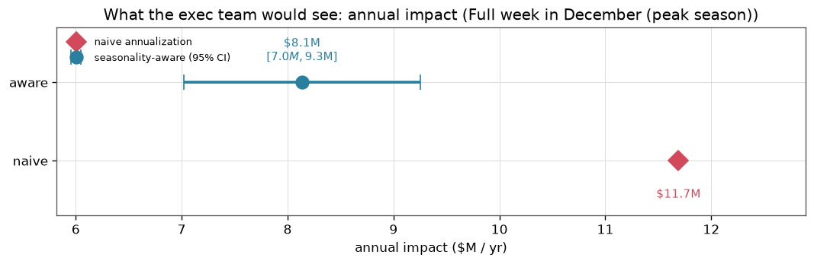
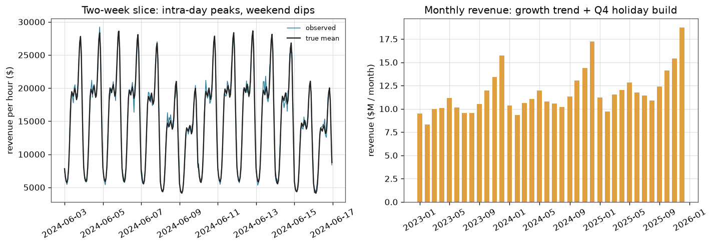
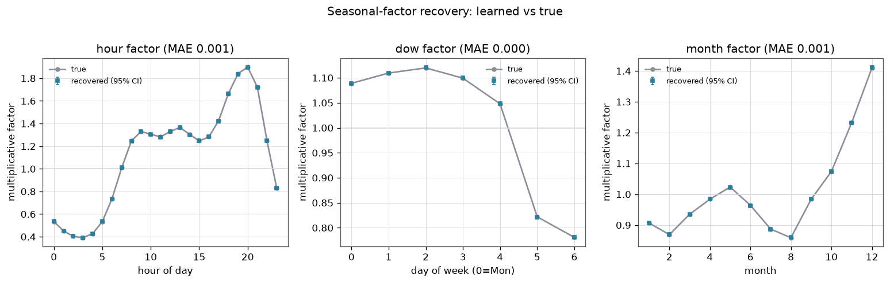
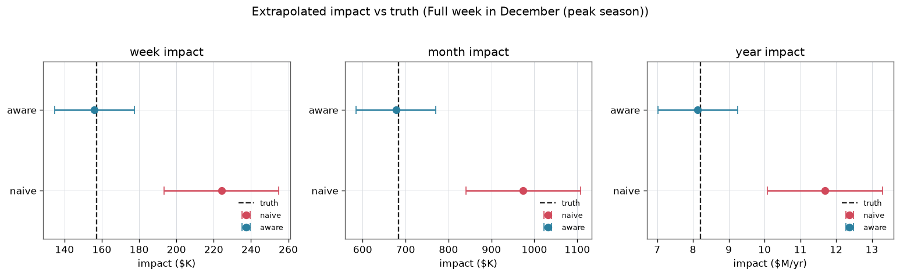
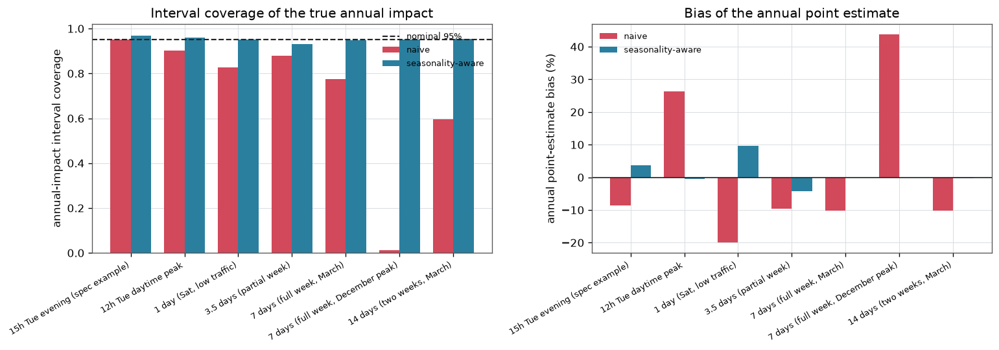
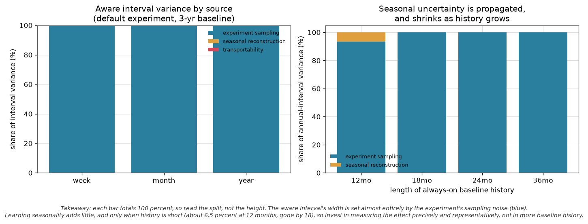
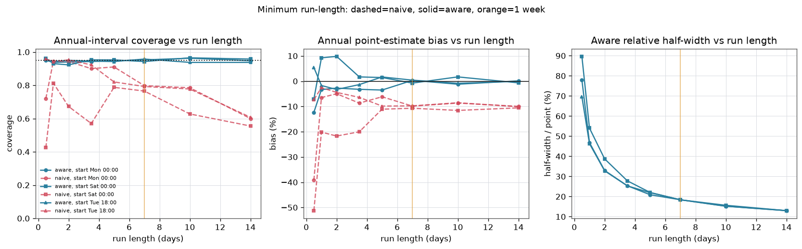
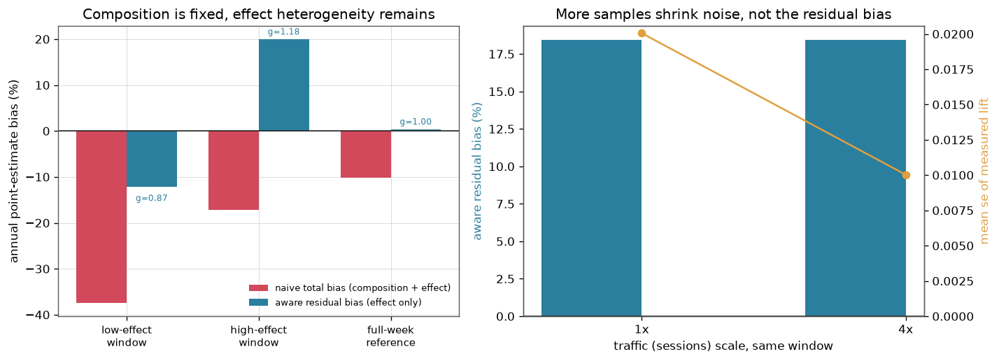

# Seasonal Extrapolation: annualizing a short experiment, defensibly

> **This is built on synthetic data.**

Teams freeze experiments through the highest-value seasons because a peak-season reading scaled naively across the year is badly wrong, which leaves the most commercially important windows untested. This project builds a seasonality-aware extrapolation that reweights a short experiment's measured relative lift by the year's true seasonal composition, learned from the always-on baseline, and propagates the full uncertainty into a calibrated annual interval. The payoff: a one-week test run in the December peak reports a defensible 8.1M dollars per year instead of the naive 11.7M that overstates the return by 43%, so experimentation can run year-round without misleading the exec team.

**Live demo:** https://k1monfared.github.io/seasonal_extrapolation/ , the interactive explorer of the naive and seasonality-aware intervals against the truth.

## Outputs

### 1. We ran a one-week test in the December peak. What yearly number do I put in front of the exec team, and how wide is the credible range?

Report 8.1M dollars per year, with a 95% range of 7.0M to 9.3M. Do not report the naive annualization of 11.7M dollars, which is 43% too high against a true annual impact of 8.20M dollars.

How: the seasonality-aware extrapolation reweights the measured 4.94% lift by the whole year's true seasonal composition instead of scaling the busy December rate across the calendar. It reads 8.14M dollars, 95% CI [7.02M, 9.25M], next to the naive 11.69M dollars [10.09M, 13.29M] and the committed true value of 8.20M dollars.

So what: take the 8.1M figure with the [7.0M, 9.3M] range into the review. The naive 11.7M would overstate the return by 43% and misdirect investment.



Figure: what a leader actually reports, the seasonality-aware 8.1M dollars with its 95% interval next to the naive 11.7M annualization point. The true annual value is unknown at decision time and is not drawn here.

### 2. How short can the test be and still be trustworthy?

Seven days, covering one full weekly cycle. At that length the reported number is both centered and tight enough to defend.

How: the run-length sweep across start phases shows that at 168 hours the aware interval covers the true annual impact 94% of the time, the point estimate is biased by under 1% (0.8%), and the relative half-width is 18%. Below a full week the bias does not settle, because the window misses part of the weekly cycle. And because the method corrects for where in the calendar the week falls, those seven days can sit anywhere, including a Christmas or Thanksgiving peak, and still give a defensible annual number.

So what: set the minimum test at 7 days spanning a full week, on top of the usual sample-size requirement. Anything shorter reports a center you cannot stand behind.

### 3. Can I just run the naive projection longer to be safe?

No. In the December full-week case the naive interval covers the true annual impact only 1% of the time, and it gets worse, not better, with more data.

How: Monte Carlo calibration over 800 replications gives naive coverage of 1% against aware coverage of 95% at the December full week. The two-week naive window falls to 60% coverage, because more sessions shrink the interval around a center that composition bias has already moved.

So what: length alone does not rescue the naive method. Use the seasonality-aware interval for any number that reaches executives.

Behind these answers are four pieces: the learned seasonality recovered from the always-on baseline, the reweighted extrapolation that carries its own uncertainty, the minimum run-length rule that requires a full weekly cycle, and the residual-effect-heterogeneity limit that flags what a single window still cannot recover. The sections below document each in turn.

---


## Contents

- [How to run](#how-to-run)
- [The problem](#the-problem)
- [How the synthetic data is created, and the goal](#how-the-synthetic-data-is-created-and-the-goal)
- [The method](#the-method)
- [Results](#results)
- [Calibration: naive vs seasonality-aware](#calibration-naive-vs-seasonality-aware)
- [Minimum run-length recommendation](#minimum-run-length-recommendation)
- [What we still cannot recover: effect heterogeneity across the cycle](#what-we-still-cannot-recover-effect-heterogeneity-across-the-cycle)
- [Business impact](#business-impact)
- [Data-science validation](#data-science-validation)
- [Limitations and what a production version would add](#limitations-and-what-a-production-version-would-add)

## How to run

Interactive demo: 

```
sh demo.sh # serves the page on a free local port and opens your browser
````

`scripts/run_demo.py` is the single entry point.

```bash
pip install -r requirements.txt
python scripts/run_demo.py
```

 It generates the data, runs the
full analysis (fit, extrapolation, calibration, minimum run-length, variance
profile, explorer grid), writes `outputs/`, and renders `docs/images/`. The full
run takes under a minute. Individual stages are also available:

```bash
python scripts/generate_data.py     # regenerate data/ only
python scripts/generate_figures.py  # re-render figures from outputs/results.json
```

Configuration lives in `configs/default.json` (seed, seasonality levels, effect
size, window grids, replication counts).

---

## The problem

Almost every business metric has an always-on control value. Whenever no
experiment is running, the metric is still recorded, so there is a long
historical baseline. From that baseline you can learn the metric's seasonality:
the intra-day shape, the day-of-week pattern (weekends are quieter), the monthly
drift, and the yearly component such as the Q4 holiday build.

When you run a **short** experiment, say Tuesday evening to Wednesday morning,
you may collect enough samples to measure the effect on that window with
statistical validity. But leadership does not want the effect on Tuesday night.
They want the **weekly, monthly, and annual** impact, in dollars, with a
credible interval. Running the experiment for a whole year is not an option.

So you extrapolate. And the naive way to extrapolate is a trap.

**The trap.** Suppose you measure the absolute impact per hour during your
window and multiply by the hours in a year. If your window sat in a high-traffic
part of the cycle (a weekday, business hours, or a peak season like December),
you overstate the year, because most of the year is quieter. Run it during a
quiet window and you understate. Either way the interval is too narrow, because
it never accounts for the parts of the cycle you did not observe. Within such a
window the naive number gets **worse the longer you run**: an unrepresentative
window's bias does not shrink with more data, only the sampling interval does, so
a longer experiment just tightens the interval around the wrong center and its
coverage of the truth falls. This is not monotonic forever, though. It reverses
once the window grows long enough to span the cycle itself, at which point the
composition bias starts to fall, and in the limit of a full year there is no
extrapolation left, so the naive estimate equals the truth up to sampling noise.
Because running for a full year is not an option, the practical regime is the
first one, where extra hours buy false confidence rather than accuracy.

The naive estimator lives in [`src/extrapolate.py`](src/extrapolate.py), and the
run-length and calibration analyses that quantify this behavior are in
[`src/runlength.py`](src/runlength.py) and [`src/calibration.py`](src/calibration.py).
The committed coverage numbers are in [`outputs/report.md`](outputs/report.md),
where, holding the phase fixed and only extending the run, a March week covers the
true annual impact 77 percent of the time against 60 percent for a March fortnight,
both carrying the same roughly 10 percent downward bias: the interval tightened, the
center did not move, so coverage dropped.

**The fix.** Because the treatment is modeled as a **relative** lift, the annual
impact is `relative_lift x annual_baseline_total`. The annual baseline total is
reconstructed from the always-on data through a learned seasonal model, which
reweights the window's relative effect by the true seasonal composition of the
whole year. The interval combines the experiment's sampling uncertainty, the
seasonal reconstruction uncertainty, and a transportability term for the parts
of the cycle the experiment never touched.

---

## How the synthetic data is created, and the goal

Everything is generated from a fixed seed by `scripts/generate_data.py`. The
metric is hourly revenue for the platform, decomposed as

```
revenue(hour) = sessions(hour) x value_per_session(hour)
```

- **Seasonality lives mostly in traffic.** Sessions carry a diurnal shape
  (evening peak near 20:00, overnight trough), a day-of-week pattern (weekends
  about 20 to 25% lower), and a monthly and yearly pattern (summer dip, strong
  Q4 holiday build). There is an 8% annual growth trend. Per-session value adds
  a mild Q4 seasonality. Traffic seasonality is what creates the composition
  trap: a short high-traffic window is not representative of the year.
- **Noise is multiplicative and heteroskedastic.** Hourly noise shrinks with
  traffic (`sigma ~ k / sqrt(sessions)`), so busy hours are measured more
  precisely than quiet ones, exactly as an aggregate of many sessions behaves.
- **The effect is a relative lift.** The treatment multiplies per-session value
  by `(1 + lift)`. Relative lift is the primary model because it is transportable
  across the cycle: a 5% lift behaves the same whether traffic is high or low,
  whereas an absolute per-hour lift mechanically scales with traffic and does
  not transport. An additive variant is supported in the config.
- **The effect is modestly heterogeneous within the week.** The true lift is a
  bit stronger in the evening and on weekends and weaker overnight, normalized so
  its annual volume-weighted mean equals the configured 5%. This is what makes
  "cover a full cycle" bite: a window that touches only part of the week measures
  the wrong average. The effect pattern does not vary by month, so one full week
  is enough to capture the average. Cross-month stability is assumed and flagged.



**Committed ground truth.** Because the full deterministic mean is known, the
true weekly, monthly, and annual baseline totals and impacts are computed
exactly and committed to `data/ground_truth.json`. The true annual baseline is
**$164.0M** and, at the true 5% lift, the true annual impact is **$8.20M**. These
are the numbers every estimate is scored against. The goal of the framework is
to recover them from a short experiment plus the always-on baseline, with a
calibrated interval.

Committed files in `data/`: `baseline_hourly.csv` (26,304 hourly rows over
2023-2025), `ground_truth.json`, `example_experiment.csv`, and
`seasonal_factors_true.csv`.

---

## The method

1. **Learn seasonality** from the always-on baseline with a weighted least
   squares log-linear model: `log revenue = trend + hour + day-of-week + month`,
   using sum-to-zero effect coding so each coefficient is a centered log seasonal
   factor, and revenue-proportional weights to match the true heteroskedasticity.
   The fit returns the factors with covariance, so every downstream quantity
   carries uncertainty.
2. **Estimate the short-window effect** as an A/B relative lift with its sampling
   variance from the session-level noise (delta method).
3. **Extrapolate.** Reconstruct the annual baseline total from the model and
   multiply by the measured relative lift. This reweights from the observed
   window to the full period using the learned composition, instead of scaling by
   clock time.
4. **Propagate uncertainty** with the delta method for a product of independent
   estimates, combining (a) experiment sampling, (b) seasonal reconstruction, and
   (c) transportability. Parts of the cycle not covered carry more uncertainty.
5. **Test transportability.** When the window spans more than one period type,
   estimate the effect within each sub-period (daypart, weekend vs weekday) and
   test equality. When it covers only one period type, flag that the assumption
   cannot be tested.

The naive comparison method scales the observed window's per-hour impact by the
number of hours in the target period, with an interval from sampling error only.

---

## Results

### Seasonal factors are recovered essentially exactly

The learned hour, day-of-week, and month factors sit on top of the true values,
and the recovered 8.08% growth matches the true 8%.



| dimension | mean abs error | max abs error | 95% CI coverage of true |
|---|--:|--:|--:|
| hour  | 0.0012 | 0.0040 | 88% |
| dow   | 0.0004 | 0.0006 | 100% |
| month | 0.0008 | 0.0016 | 100% |

### Headline: a full week in December

The default experiment runs a full week in December, a peak-season window that
covers the whole weekly cycle but not the whole year. It is the cleanest
illustration of why day-of-week coverage alone is not enough.

- Measured relative lift `0.0494` (true `0.0500`).
- **Seasonality-aware annual impact: $8.14M, 95% CI [$7.02M, $9.25M]** (true $8.20M).
- Naive annual impact: **$11.69M** [$10.09M, $13.29M], **43% too high**, because
  December is far busier than a typical month and the naive method treats the
  December rate as if it held all year.



The naive interval sits entirely above the truth at every horizon. The aware
interval is centered on the truth and covers it.

---

## Calibration: naive vs seasonality-aware

This is the integrity check. For each window we resimulate the experiment and the
baseline hundreds of times, form both intervals, and measure how often each
covers the **true** annual impact (nominal 95%), plus the bias of the point
estimate.



| window | naive cov | naive bias | aware cov | aware bias |
|---|--:|--:|--:|--:|
| 15h Tue evening (spec example) | 95% | -8.6% | 97% | +3.8% |
| 12h Tue daytime peak | 90% | +26.3% | 96% | -0.5% |
| 1 day (Sat, low traffic) | 83% | -20.0% | 95% | +9.6% |
| 3.5 days (partial week) | 88% | -9.6% | 93% | -4.2% |
| 7 days (full week, March) | 77% | -10.3% | 95% | -0.1% |
| 7 days (full week, December peak) | **1%** | +43.7% | 95% | +0.0% |
| 14 days (two weeks, March) | 60% | -10.3% | 95% | -0.2% |

Two things stand out.

- **The seasonality-aware interval is calibrated everywhere** (93 to 97% for a
  95% target) and its point estimate is close to unbiased once the window covers
  a full week.
- **The naive interval is biased and over-confident, and it gets worse with more
  data.** The two-week window (60%) and especially the December full week (**1%**)
  show the failure mode: more sessions shrink the naive interval around a center
  that composition bias has already moved, so coverage collapses. The naive
  method only looks acceptable for short windows because those intervals happen
  to be wide.

### Where the aware interval's uncertainty comes from



This is a 100 percent stacked chart, so each bar totals 100 percent and the
information is the split within it, not the height. A bar that is almost all blue
means the aware interval's width comes almost entirely from the experiment's
sampling noise, with the seasonal-reconstruction (orange) and transportability
(red) shares too small to see. The right panel is the exception: with only 12
months of history the seasonal share is a visible band, about 6.5 percent, and it
vanishes as history grows.

With a multi-year always-on baseline the seasonal factors are pinned down so
precisely that the annual interval is dominated by the short experiment. The
seasonal reconstruction term is correctly propagated but small here. It grows
when history is short (about 6.5% of the annual-interval variance with one year
of history) and vanishes with more. The practical lesson: the binding constraint
is measuring the effect precisely and representatively, not learning seasonality.
The seasonal model earns its keep in the **point** correction, which the naive
bias column above quantifies.

---

## Minimum run-length recommendation

We sweep run length and start phase and, for each, measure the aware interval's
coverage, the point-estimate bias, and the relative half-width.



- **Bias falls to near zero once the window covers a full week** (the orange
  line), for every start phase. Below a week the measured lift reflects only the
  part of the cycle observed, so it is not the annual average.
- **Precision** (relative half-width) alone would suggest about 5 days, but the
  **seasonality floor** requires a full weekly cycle to remove composition bias.

**Recommendation: at least 168 hours (7 days), covering one full weekly cycle,
plus enough traffic to bring the relative half-width within 25%.** In this
demonstration 7 days satisfies both (aware coverage 94%, half-width 18%, bias
under 1%). The floor is on top of, not instead of, the usual sample-size
requirement.

---

## What we still cannot recover: effect heterogeneity across the cycle

Let's be clear about what the seasonality-aware method does and does not fix. It
corrects the baseline **composition**, that is, WHERE the volume sits across the
cycle. It does **not** recover how the treatment's **relative lift itself varies
across the cycle**. It multiplies one measured relative lift by the annual
baseline, which assumes the lift is the same for every hour and every day.

In reality the relative lift on a Monday morning can genuinely differ from the
relative lift on a Friday night. A short experiment run in a single window
measures only that window's relative lift. You cannot recover the
period-specific lifts from one window. So applying that single number to the
whole year is **still an extrapolation**, just a milder one than ignoring
seasonality. Think of it as a ladder:

1. **Fully naive**: scale the window's per-hour impact by clock time. Ignores
   composition. Most biased.
2. **Seasonality-aware with a constant-relative-effect assumption** (what this
   repo does): fixes composition, still assumes one lift for the whole cycle.
   Much better, but a residual bias remains if the window's local lift is not
   the annual average.
3. **The ideal**: measure the relative lift across the periods themselves,
   by running across the cycle or modeling effect heterogeneity explicitly.

### Quantifying the residual bias

The synthetic effect is deliberately heterogeneous within the week (stronger in
the evening and on weekends, weaker overnight, normalized so the annual
volume-weighted mean is exactly 5%). Running the aware extrapolation from a
window placed in a low-effect period and in a high-effect period isolates the
residual, because the composition has already been corrected. All numbers below
are from the committed run (`outputs/results.json`, section
`effect_heterogeneity`).



| window | g_local | c_local | aware residual bias | naive total bias |
|---|--:|--:|--:|--:|
| low-effect (weekday overnight to morning) | 0.866 | 0.718 | **-12.2%** | -37.5% |
| high-effect (Saturday evening) | 1.182 | 0.695 | **+20.0%** | -17.2% |
| full-week reference (Mon to Sun) | 1.000 | 0.899 | +0.4% | -10.1% |

- `g_local` is the true local relative lift divided by the annual-mean lift. The
  aware residual bias tracks `g_local - 1` almost exactly (-13% and +18%
  predicted), because that is precisely what a constant-effect assumption cannot
  see.
- `c_local` is the window baseline rate divided by the annual rate. This is the
  composition error, and it is the part the aware method removes. The two
  columns are two **different** errors: at the low-effect window the composition
  error (`c_local - 1 = -28%`) and the effect error (`-12%`) both push down, so
  naive is badly biased (-37.5%), while the aware method strips out the
  composition and leaves only the -12.2% effect residual.
- At the full-week reference the effect residual is essentially zero (+0.4%),
  because a full week averages the within-week heterogeneity, yet the naive
  method still carries a -10.1% composition error.

### This residual is not a sampling problem

The residual bias comes from the unobserved variation of the effect, not from
noise, so it does **not** shrink with more samples in the same window. Holding
the Saturday-evening window fixed and quadrupling traffic halves the sampling
error of the measured lift but leaves the bias untouched:

| sessions scale | mean se of measured lift | aware residual bias |
|--:|--:|--:|
| 1x | 0.0201 | +18.4% |
| 4x | 0.0100 | +18.4% |

More data buys precision around the wrong number. Only observing the other parts
of the cycle can fix it.

### The fix

To capture the per-period relative lift you must either run the experiment
across those periods (a longer run that spans at least one full weekly cycle, or
windows placed in different periods) or model the effect heterogeneity
explicitly, and flag it as an assumption when you cannot. This is why the
minimum run-length recommendation is a full weekly cycle rather than
just enough samples, and it is what the transportability tests described under
Data-science validation are for: when a window spans multiple period types they
estimate the lift within each and test whether one number is defensible, and when
a window covers a single period type they flag that the assumption cannot be
tested at all.

---

## Business impact

The real value is not that seven days beats a full year, no one runs a year-long
test. It is that experimentation no longer has to avoid the calendar's most
commercially important windows. Teams routinely freeze tests through the Christmas
and Thanksgiving peaks, or discard whatever they measure then, because a
peak-season reading scaled naively across the year is badly wrong. By modeling the
ideal, the answer a fully representative full-year measurement would have
given, a one-week test run in the middle of the December peak still reports a
defensible annual number: **$8.1M per year, 95% CI [$7.0M, $9.3M]**, instead of
pausing experimentation or shipping the naive **$11.7M** that overstates the
return by 43% and would misdirect investment. The experiment keeps running through
the seasons that matter most, and the number that reaches executives stays defensible.

Explore it interactively in `docs/index.html`: pick a start phase, a run length,
and a horizon, and watch the naive and seasonality-aware intervals move against
the truth.

---

## Data-science validation

- **Seasonal recovery** against known truth (see Results).
- **Extrapolation accuracy** against the committed true weekly, monthly, and
  annual impact (see Results and Calibration: naive vs seasonality-aware).
- **Interval calibration** by Monte Carlo, showing the aware interval covers at
  the nominal rate and the naive interval does not (see Calibration: naive vs
  seasonality-aware).
- **Transportability** made explicit and testable: the effect is estimated
  within sub-periods and tested for homogeneity. When a window covers a single
  period type the assumption is flagged as untestable.
- Everything is reproducible from one seed. `outputs/report.md` and
  `outputs/results.json` are regenerated and committed by the demo, and every
  figure is rendered from those results.

---

## Limitations and what a production version would add

- **Constant-relative-effect assumption (see What we still cannot recover: effect heterogeneity across the cycle).** The aware method
  assumes one relative lift for the whole cycle, so it carries a residual bias
  when the experiment window's local lift differs from the annual average. In the
  synthetic data the effect varies within the week but not across months, so one
  full week captures the annual-average effect. A real effect could also drift
  seasonally. A production version would run across the relevant periods or model
  effect heterogeneity explicitly with its own uncertainty. The current code
  flags cross-month stability as an untestable assumption.
- **Single metric, log-linear seasonality.** Real programs have many metrics,
  interactions (hour-by-day-of-week), holidays as named events, and level shifts.
  A production model would use richer seasonal bases, holiday regressors, and a
  proper retransformation treatment (the smearing correction here treats its own
  variance as second order).
- **Delta-method intervals.** These are accurate here and cross-checked by Monte
  Carlo. A production version might report the Monte Carlo interval directly, and
  add novelty and primacy effects, weekly cohort dynamics, and network
  interference where relevant.
- **Forward projection risk.** The annual baseline is projected from a fitted
  trend. Genuine macro uncertainty about next year's level would be added as an
  explicit forecast-variance component (the framework already propagates the
  estimation part, which is why short histories widen the interval).
- **Governance.** A production system would version the seasonal model, monitor
  drift between the learned factors and live data, and gate decisions on the
  transportability flag.
